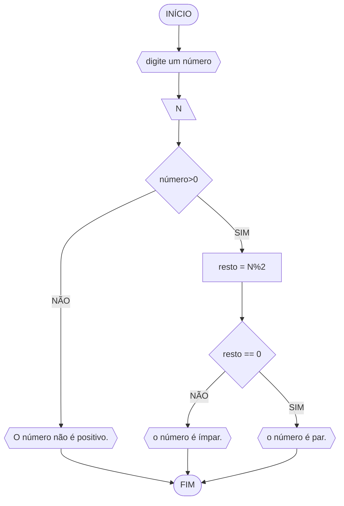
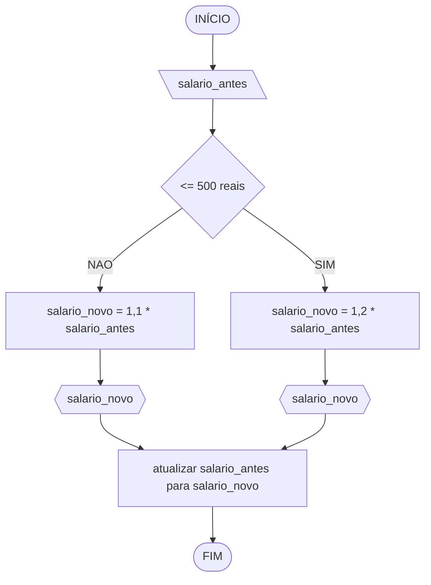
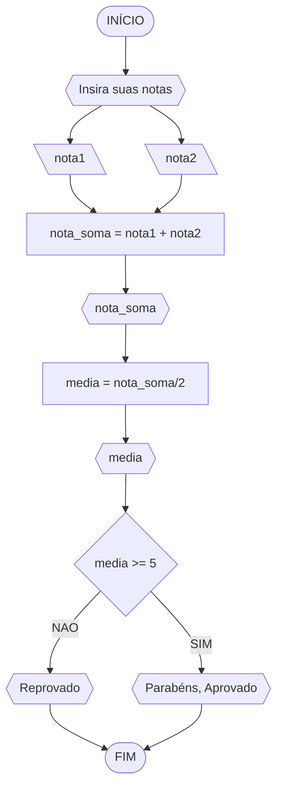
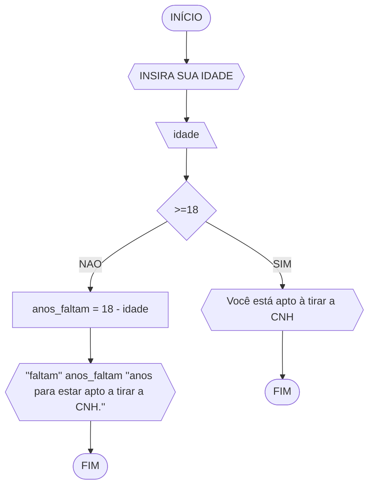

<p> 
	Curso: Ciências Da Computação <br>
	Disciplina: Raciocínio Lógico Algorítmico <br>
	Código/Turma: T160-39 <br>
	Professor: Ricardo Carubbi <br>
	Data: 21/03 <br>
	Aluno(a): Kaio Damasceno Mendes <br>
	Matrícula: 2417213 <br>

1a chamada (Sim/Não): SIM <br>
2a chamada (Sim/Não): NÃO
</p>


## Q1

determinar se um número inteiro e positivo é par ou ímpar
---
### Fluxograma


### Pseudocódigo
```
	  ALGORITMO verifica_par_impar
	   DECLARE numero, resto NUMERICO
	 INICIO
	   ESCREVA "Digite um número."
	   LEIA numero
	   SE numero > 0 ENTAO
		   resto == numero%2
	  			 SE resto == 0 ENTAO
					 ESCREVA "O número é par."
	 			 SENAO 
					 ESCREVA "O número é ímpar."
				FIM_SE
	  SENAO 
		   ESCREVA "Porfavor, digite um número positivo"
	 FIM_SE
   FIM_ALGORITMO		
```
### TESTE 1	
| entrada | numero>0 | resto | resto == 0 | saida                   |   |
|---------|----------|-------|------------|-------------------------|---|
| 1       | sim      | 1     | não        | é ímpar                 |   |
| 2       | sim      | 0     | sim        | é par                   |   |
| 8       | sim      | 0     | sim        | é par                   |   |
| -16     | não      | X     | X          | O número não é positivo |   |

<!--esse símbolo "%" divíde por X e já mostra o RESTO da divisão-->

## Q2
Represente, em fluxograma e pseudocódigo, um algoritmo para calcular o novo salário de um funcionário. Sabe-se que os funcionários que recebem atualmente salário de até R$ 500 terão aumento de 20%; os demais terão aumento de 10%.
### Fluxograma
<!--sistema que lê no banco de dados o salário do funcionário e já calcula o novo salário e atualiza no banco de dados-->


### Pseudocódigo
```
	ALGORITMO
	DECLARE salario_antes, salario_novo float >= 0
		INICIO
			LEIA salario_antes
				SE salario_antes <= 500 ENTAO
					salario_novo == 1.2 * salario_antes
				SENAO
					salario_novo == 1.1 * salario_antes
				FIM_SE
			LEIA salario_novo
			salario_antes ← salario_novo 
		FIM
		
```

### TESTE 2
| salário antigo | <=500? | salário novo |   |
|----------------|--------|--------------|---|
| 500            | SIM    | 600          |   |
| 501            | NÃO    | 551,1        |   |
| 3000           | NÃO    | 3300         |   |
| 300            | SIM    | 360          |   |


## Q3
Represente, em fluxograma e pseudocódigo, um algoritmo para calcular a média aritmética entre duas notas de um aluno e mostrar sua situação, que pode ser aprovado ou reprovado.
### Fluxograma

### Pseudocódigo
```
	ALGORITMO
	DECLARE nota1, nota2, nota_soma, media: float >= 0
		INICIO
			ESCREVA "Digite nota 1 e nota 2:"
			LEIA nota1, nota2
			nota_soma ← nota1 + nota2
			LEIA nota_soma
			media ← nota_soma/2
			LEIA media
			SE media >= 5 ENTAO
				ESCREVA "Sua média é:" media "situação: aprovado"
			SENAO
				ESCREVA "Sua média é:" media "situação: reprovado"
			FIM_SE
		FIM
```
				
			
### TESTE 3
| nota 1 | nota 2 | soma | média | média >= 5 | situação  |
|--------|--------|------|-------|------------|-----------|
| 5      | 5      | 10   | 5     | sim        | aprovado  |
| 3      | 10     | 13   | 6,5   | sim        | aprovado  |
| 1      | 6      | 7    | 3,5   | não        | reprovado |
| 2      | 6      | 8    | 4     | não        | reprovado |

## Q4
Represente, em fluxograma e pseudocódigo, um algoritmo que, a partir da idade do candidato(a), determinar se pode ou não tirar a CNH. Caso não atender a restrição de idade, calcular quantos anos faltam para o candidato estar apto.
### Fluxograma

### Pseudocódigo
```
	ALGORITMO
	DECLARE idade, anos_faltam int >= 0
		INICIO
			ESCREVA "Digite sua idade:"
			LEIA idade
			SE idade >= 18 ENTAO
				ESCREVA "Você está apto à tirar a CNH!"
			SENAO
				anos_faltam ← 18 - idade
				ESCREVA "faltam" anos_faltam "anos para estar apto a 
				tirar a CNH."
			FIM_SE
		FIM
	 
```
### TESTE 4
| idade | >= 18 | pode tirar cnh | quantos anos para poder tirar cnh |
|-------|-------|----------------|-----------------------------------|
| 5     | não   | não            | 13                                |
| 19    | sim   | sim            |                                   |
| 29    | sim   | sim            |                                   |
| 17    | não   | não            | 1   
