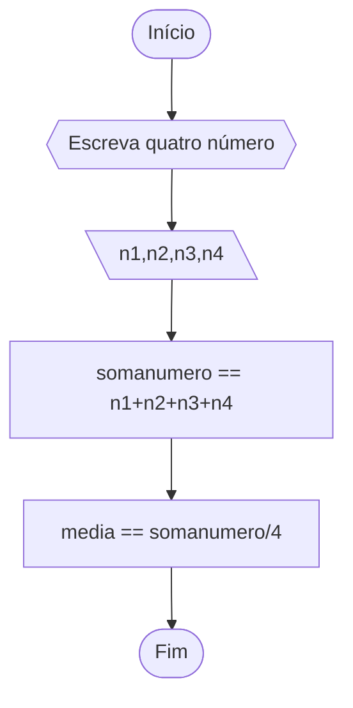
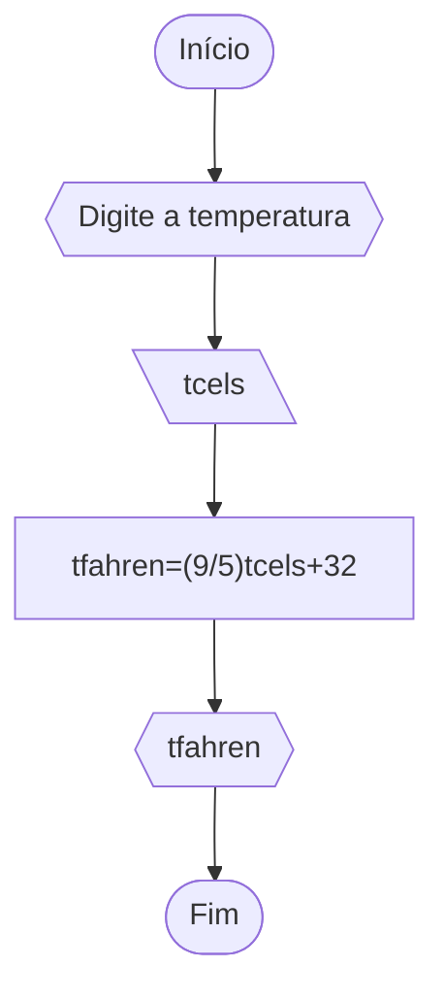
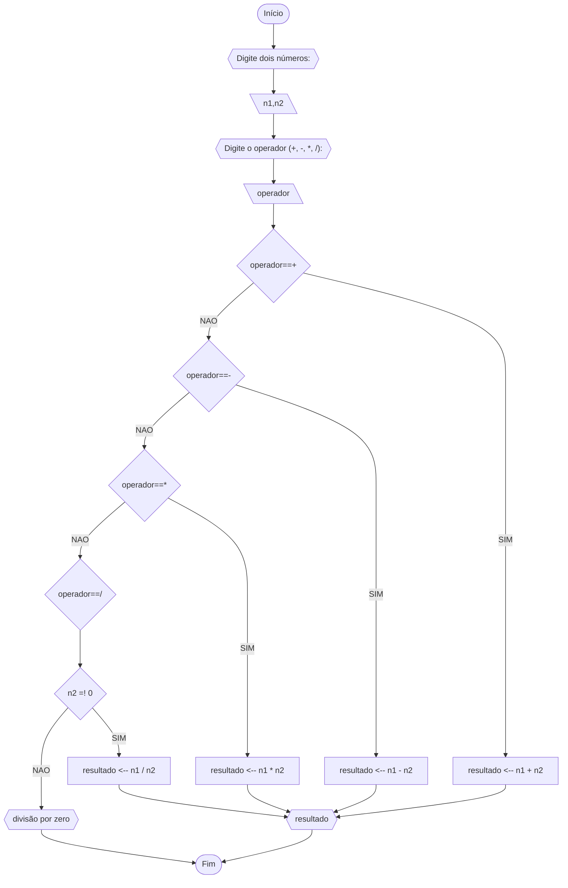
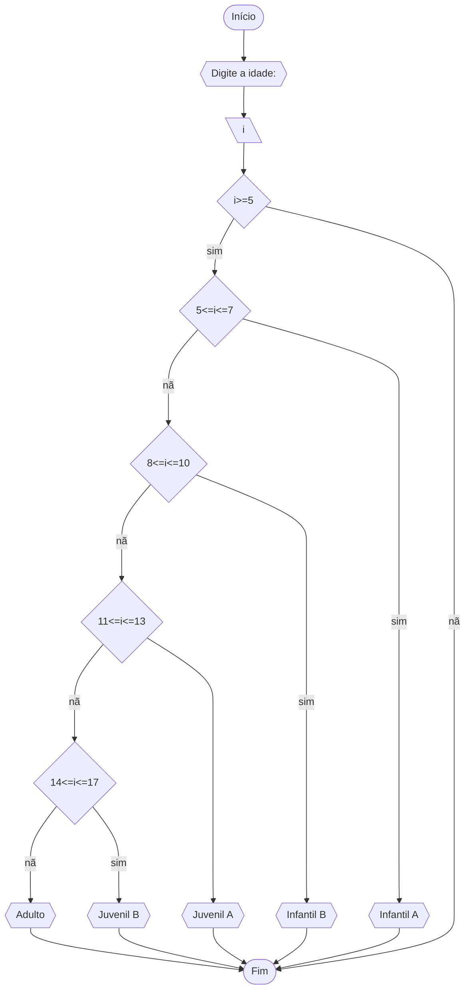

<p> 
	Curso: Ciências Da Computação <br>
	Disciplina: Raciocínio Lógico Algorítmico <br>
	Código/Turma: T160-39 <br>
	Professor: Ricardo Carubbi <br>
	Data: 21/03 <br>
	Aluno(a): Kaio Damasceno Mendes <br>
	Matrícula: 2417213 <br>

1a chamada (Sim/Não): SIM <br>
2a chamada (Sim/Não): NÃO
</p>


# Lista 2
## Q1
Calcule a média de quatro números inteiros dados.
### Fluxograma


### Pseudocódigo
```
	ALGORITMO
	DECLARE n1, n2, n3, n4, somanumero, media int >=0
		INICIO
			ESCREVA "Digite quatro números inteiros:"
			LEIA n1, n2, n3, n4
			somanumero ← n1 + n2 + n3 + n4
			LEIA somanumero
			media ← somanumero/4
			LEIA media
		FIM
```
			
### Teste 1
| n1 | n2 | n3 | n4 | soma | media |
|----|----|----|----|------|-------|
| 5  | 4  | 3  | 2  | 14   | 3.5   |
| 10 | 10 | 5  | 5  | 30   | 7.5   |
| 20 | 10 | 5  | 0  | 35   | 8.75  |
| 30 | 40 | 50 | 60 | 180  | 45    |

## Q2
Leia uma temperatura dada em Celsius (C) e imprima o equivalente em Fahrenheit (F). (Fórmula de conversão: F = (9/5) * C + 32)
### Fluxograma

### Pseudocódigo
	ALGORITMO
	DECLARE tcels, tfahren float
		INICIO
			ESCREVA "Digite a temperatura em graus celsius:"
			LEIA tcels
			tfahren ← (9/5) * tcels + 32
			LEIA tfahren
			ESCREVA tcels "em fahrenheit:" tfahren
		FIM
### Teste 2
|Celsius (C°)|Fahrenheit (F°)|
|-|-|
|0|32|
|20|68|
|100|212|

## Q3
Receba dois números reais e um operador e efetue a operação correspondente com os valores recebidos (operandos). O algoritmo deve retornar o resultado da operação selecionada simulando todas as operações de uma calculadora simples.
### Fluxograma

### Pseudocódigo
```
	ALGORITMO calculadora_simples
	DECLARE n1, n2, resultado: float
	DECLARE operador, +, -, *, / : operadores
		INICIO
			ESCREVA "Digite dois números e uma operação:"
			LEIA n1, n2, operador
			SE operador ← + ENTAO
				resultado == n1 + n2
			FIM_SE
			SE operador ← - ENTAO
				resultado == n1 - n2
			FIM_SE
			SE operador ← * ENTAO
				resultado == n1 * n2
			FIM_SE
			ENQUANTO operador ← / e n2 = 0 FAÇA
				ESCREVA "ERRO: divisão por zero"
			FIM_ENQUANTO
			SE operador ← / e n2 =! 0 ENTAO
				resultado == n1 / n2
			FIM_SE
			LEIA resultado
			ESCREVA resultado
		FIM
```
### Teste 3
| numero1 | operação | numero2 | numero2 =! 0 | divisivel | resultado |
|---------|----------|---------|--------------|-----------|-----------|
| 1       | +        | 1       | sim          | sim       | 2         |
| 2       | -        | 1       | sim          | sim       | 1         |
| 7       | *        | 10      | sim          | sim       | 70        |
| 6       | /        | 0       | nao          | nao       |           |
| 6       | /        | 3       | sim          | sim       | 3         |

## Q4
Elaborar um algoritmo que, dada a idade, classifique nas categorias: 
infantil A (5 - 7 anos), 
infantil B (8 -10 anos), 
juvenil A (11 - 13 anos),
juvenil B (14 -17 anos) e 
adulto (maiores que 18 anos).
### Fluxograma

### Pseudocódigo
```mermaid
	ALGORITMO idadenadador
	DECLARE idade: NUMERICO int >= 5
	DECLARE ia, ib, ja, jb, ad NUMERICO
		INICIO
			ESCREVA "Digite sua idade:"
			SE (5=<idade>=7) ENTAO
				idade → ia
			FIM_SE 
			SE (8=<idade>=10) ENTAO
				idade → ib
			FIM_SE 
			SE (11=<idade>=13) ENTAO
				idade → ja
			FIM_SE 
			SE (14=<idade>=17) ENTAO
				idade → jb
			FIM_SE 
			SE (idade>=18) ENTAO
				idade → ad
			FIM_SE
		FIM 
```
### Teste 4
| idade | categoria  |   |   |
|-------|------------|---|---|
| 8     | infantil B |   |   |
| 11    | juvenil A  |   |   |
| 18    | adulto     |   |   |

