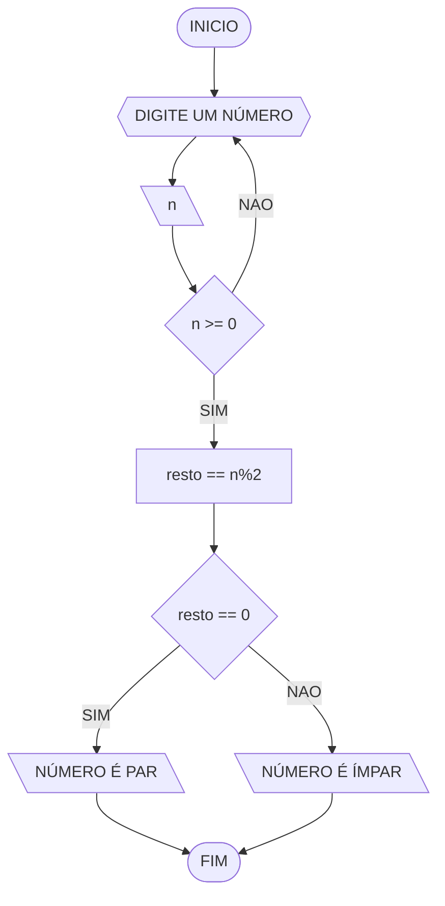
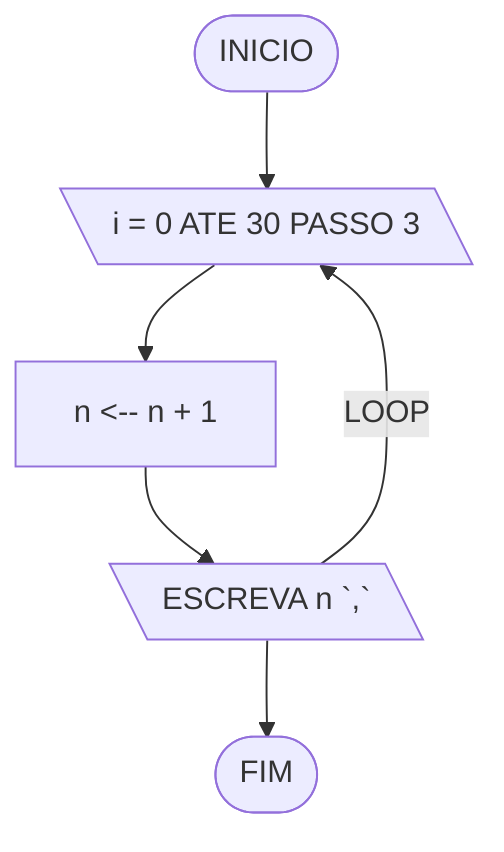
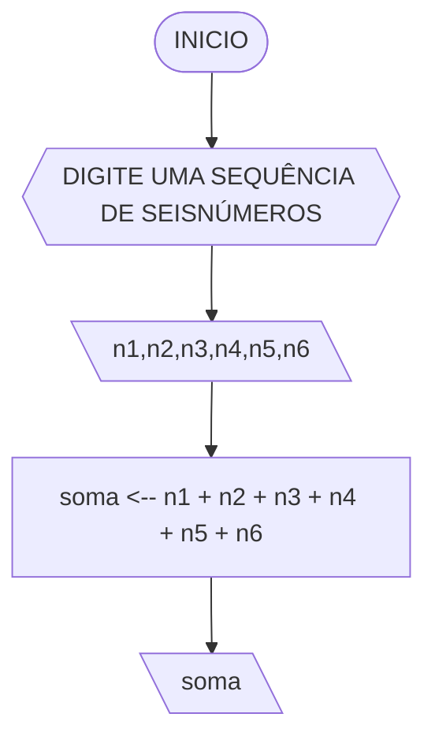
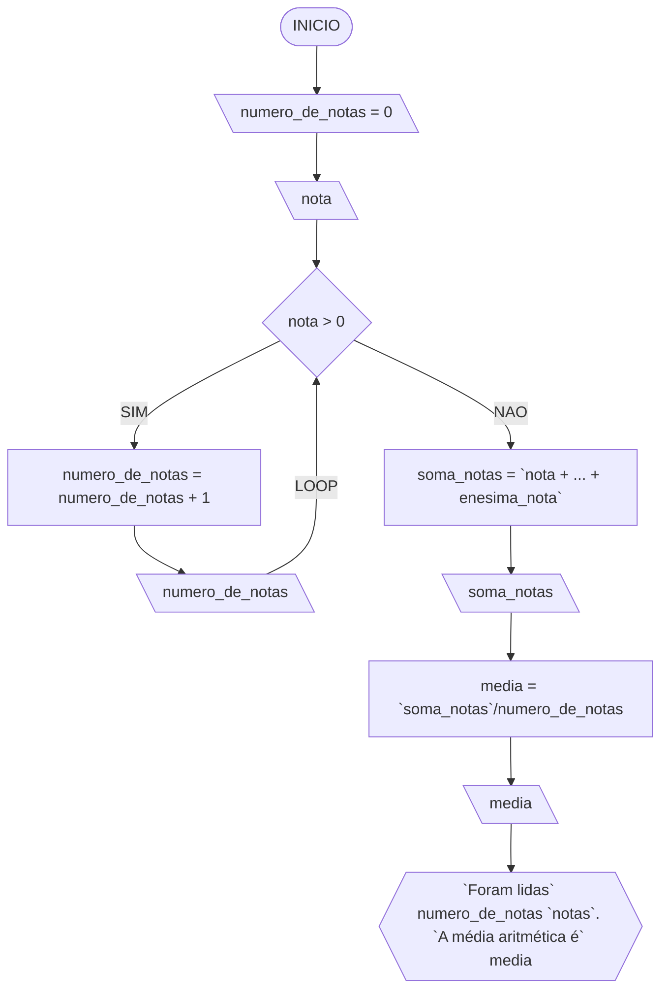

# Lista de exercícios 3
## Q1:
	Atualize o algoritmo para determinar se um número inteiro e positivo é par ou ímpar, usando uma laço condicional para aceitar apenas números maiores ou iguais a zero.
	
### Fluxograma


### Pseudocódigo
```
ALGORITMO n-int-parouimpar
	DECLARE n resto: int
		INICIO
			ESCREVA "Digite um número inteiro positivo"
			LEIA n
				ENQUANTO n < 0 FAÇA
					ESCREVA " Digite um número positivo."
				FIM_ENQUANTO
				n ← n
				resto ← n%2
				LEIA resto
				SE resto == 0 ENTAO
					ESCREVA n "é par"
				SENAO
					ESCREVA n "é ímpar"
				FIM_SE
		FIM
```

### Teste Q1

| número | resto | situação |
|--------|-------|----------|
| 2      | 0     | par      |
| 3      | 1     | ímpar    |
| 5      | 1     | ímpar    |


## Q2:
Faça um algoritmo que exiba na tela uma contagem de 0 até 30, exibindo apenas os múltiplos de 3.
### Fluxograma

### Pseudocódigo
```
	ALGORITMO contagem0-30
	DECLARE n, i: int
		INICIO
			PARA i DE 0 ATE 30 PASSO 3 FAÇA
				n ← n + i
				ESCREVA n ","
			FIM_PARA
		FIM
```
			
### Teste Q2
| rep | n  | n ← n + i  |   |   |
|-----|----|------------|---|---|
| 1   | 0  | 0 + 3      |   |   |
| 2   | 3  | 3 + 3      |   |   |
| 3   | 6  | 6 + 3      |   |   |
| 4   | 9  | 9 + 3      |   |   |
| 5   | 12 | 12 + 3     |   |   |
| 6   | 15 | 15 + 3     |   |   |
| 7   | 18 | 18 + 3     |   |   |
| 8   | 21 | 21 + 3     |   |   |

## Q3:
Dada uma sequência de números inteiros, calcular a sua soma. Por exemplo, para a sequência {12, 17, 4, -6, 8, 0}, o seu programa deve escrever o número 35.
### Fluxograma


### Pseudocódigo
```
	ALGORITMO soma_sequencia_int
	DECLARE n1, n2, n3, n4, n5 ,n6, soma: int
		INICIO
			ESCREVA "Digite uma sequência de seis números inteiros:"
			LEIA n1, n2, n3, n4, n5 ,n6
			soma ← (n1 + n2 + n3 + n4 + n5 + n6)
			LEIA soma
			ESCREVA "soma da sequência é:" soma
		FIM
```
### Teste Q3
| n1  | n2  | n3 | n4 | n5 | n6 | soma |
|-----|-----|----|----|----|----|------|
| -12 | 376 | 0  | 0  | 2  | 1  | 367  |
| 1   | 2   | 3  | 4  | 5  | 6  | 21   |
| 5   | 10  | 15 | 20 | 30 | 40 | 120  |

## Q4:
Escreva um programa que leia a nota de diversos alunos, até que seja digitada uma nota negativa. Nesse momento, ele mostra a média aritmética de todas as notas lidas e quantas notas foram lidas. Ex. Foram lidas 14 notas. A média aritmética é 6.75!
### Fluxograma

### Pseudocódigo
	ALGORITMO
	DECLARE nota, enesima_nota, media, soma_notas, numero_de_notas: int
		INICIO
			numero_de_notas ← 0
			ENQUANTO nota > 0 FAÇA
				LEIA nota
				numero_de_notas ← numero_de_notas + 1
			FIM_ENQUANTO
			numero_de_notas ← numero_de_notas 
			ESCREVA "Foram lidas" numero_de_notas "notas"
			soma_notas ← (nota + ... + enesima_nota)
			media ← (soma_notas)/numero_de_notas
			LEIA soma_notas, media
			ESCREVA "Foram lidas" numero_de_notas "notas." "A média aritmética é" 
			media
		FIM
### Teste Q4
| notas | numero de notas |  soma notas(TOTAL)     | media         |
|-------|-----------------|------------------------|---------------|
| 10    | 5               |                        |               |
| 9     | 2               |                        |               |
| 7     | 8               | 50+18+56+50+15+3 = 192 | 192/33 = 5,82 |
| 5     | 10              |                        |               |
| 3     | 5               |                        |               |
| 1     | 3               |                        |               |
