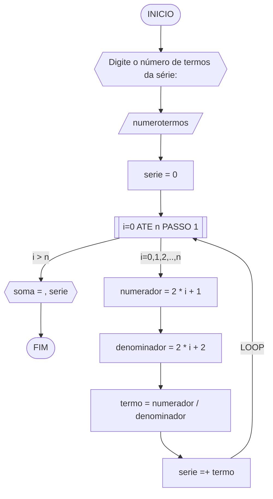

# Lista de Questões AD1
## Q1
Dadas duas variáveis, a e b, implemente e teste um algoritmo para trocar os valores atribuídos a elas.
### Pseudocódigo
```
	ALGORITMO
	DECLARE a, b, aux: int
		INICIO
			ESCREVA "Exiba os dois valores originais"
			LEIA a,b 
			ESCREVA "a=", a
			ESCREVA "b=", b
			aux ← a
			a ← b
			b ← aux
			LEIA a, b, aux
			ESCREVA "Novos valores:"
			ESCREVA "a=", a
			ESCREVA "b=", b
		FIM
			
			
```
			
### Fluxograma


### Teste
| a | b | aux <- a | novos valores(a,b) |
|---|---|----------|--------------------|
| 2 | 5 | 2        | 5,2                |
| 9 | 2 | 9        | 2,9                |
## Q2
Dado um conjunto "n" de notas de alunos em um exame, implemente e teste um algoritmo para fazer uma contagem "cont" do número de alunos que foram aprovados no exame. Será considerado aprovado o aluno que tirar "nota" 50 ou maior (no intervalo de 0 a 100).
### Pseudocódigo
	ALGORITMO contar_aprovados
	DECLARE numeronotas, nota,nota', cont: int
		INICIO
			cont ← 0
			LEIA nota
			PARA  cada nota' de 0 ATE n FAÇA
				ENQUANTO 50 =< nota >= 100
					cont ← cont + 1
					LEIA cont
				FIM_ENQUANTO
			FIM_PARA
			cont ← cont
			LEIA cont
			ESCREVA cont "Aluno(s) aprovados"
		FIM
### Fluxograma

### Teste
| nota | cont | saida cont          |
|------|------|---------------------|
| 51   | 1    |                     |
| 89   | 2    | 1 + 2 + 3 = 6 notas |
| 90   | 3    |                     |
## Q3
Dado um conjunto de n números, implemente e teste um algoritmo para calcular a soma desses números.  
Aceite apenas n maior ou igual a zero.
### Pseudocódigo
```
	ALGORITMO soma_n_numeros
	DECLARE ninicial, nfinal, numerotermos, soma_numero, soma_n_numeros: int
		INICIO
			ESCREVA "Digite o primeiro e o último número do conjunto e uma quantidade de termos maior ou igual a zero para o conjunto:"
			LEIA ninicial, nfinal, numerotermos
			ENQUANTO numerotermos < 0 FAÇA
				ESCREVA "ERRO: quantidade de termos menor que zero, digite outro 
				valor"
			FIM_ENQUANTO
			numerotermos ← numerotermos
			LEIA numerotermos
			soma_numero ← (ninicial + nfinal)/2 
			LEIA soma_numero
			soma_n_numeros ← (somanumero) * numerotermos
			LEIA soma_n_numeros
			ESCREVA "a soma dos" numerotermos "termos é" soma_n_numeros
		FIM
```
			
			
			
### Fluxograma

### Teste
| n1 | nultimo | numero de termos | soma n numeros  |
|----|---------|------------------|-----------------|
| 1  | 6       | 3                | 7               |
| 4  | 8       | 3                | 18              |
| 10 | 20      | 6                | 30              |
## Q4
Dado um conjunto de n termos da série, implemente e teste um algoritmo para calcular o valor de S, conforme definido abaixo:


### Pseudocódigo
```	
	ALGORITMO PA_ntermos
	DECLARE soma, serie, termo, numerotermos,  numerador, denominador, i: float > 0
		INICIO
			numerador1 ← 1
			denominador1← 2
			soma ← 0
			ESCREVA "Digite o número de termos para o conjunto"
			LEIA numerotermos
			ENQUANTO numerotermos < 0 FAÇA
				ESCREVA "ERRO: Digite número de termos maior que zero"
			FIM_ENQUANTO
			numerotermos ← numerotermos
			SE i < n ENTAO
				PARA i de 0 ATE numerotermos PASSO 1 FAÇA
					numerador ← 2 * i + 1
					denominador ← 2 * i + 2
					LEIA numerador, denominador
					termo ← numerador / denominador
					LEIA termo
					serie =+ termo
				FIM_PARA
			SENAO
				soma == serie
			FIM_SE
		FIM
			
			
		
```

		
### Fluxograma

### Teste
| it | numerotermos  | serie  | i | numerador | denominador | termo | serie =+ termo     | saída                  |
| -- | -- | -- |-- | --        | --          | --    | --             | --                     |
|    | 0  | 0  |   |           |             |       |                |                        |
| 1  | 4  | 0  | 0 | 2*0+1 = 1 | 2*0+2 = 2   | 1/2   | 0+1/2 = 0.5    |                        |
| 2  | 4  | 0  | 1 | 2*1+1 = 1 | 2*1+2 = 2   | 3/4   | 1/2+3/4 = 1.25 |                        |
| 3  | 4  | 0  | 2 | 2*2+1 = 1 | 2*2+2 = 2   | 5/6   | 1.25+1/2 = 1.75   |                        |
| 4  | 4  | 0  | 3 | 2*3+1 = 1 | 2*3+2 = 2   | 7/8   | 1.75+1/2 = 2.25   | soma = 5.75 |
## Q5
Dado um número n, implemente e teste um algoritmo para calcular o fatorial de n (escrito como n!), onde n≥0.
### Pseudocódigo
	ALGORITMO nfatorial
	DECLARE n, n!: int >= 0
		INICIO
			ESCREVA "Digite um número:"
			LEIA n
			ENQUANTO n < 0 FAÇA
				ESCREVA "ERRO: número menor que zero, digite outro número"
			FIM_ENQUANTO
			n ← n
			n! ← n * (n-1) * (n-2) * (n-3) * ... * 1
			LEIA n!
			ESCREVA "O fatorial de", n "é", n!
		FIM
			
### Fluxograma

### Teste
| n  | n!        |
|----|-----------|
| 5  | 120       |
| 8  | 40.320    |
| 10 | 3.628.800 |
## Q6
Gerar e imprimir os n primeiros termos da sequência de Fibonacci, onde n≥1.  
Os primeiros termos são: 0,1,1,2,3,5,8,13,…  
Cada termo, além dos dois primeiros, é derivado da soma dos seus dois antecessores mais próximos.
1.  Obter o número de termos  n, onde  n≥1;
2.  Inicializar os dois primeiros termos da série nas variável  a  e  b  com 0 (zero);
3.  Iterar o valor de  n, ou seja, executar  n  vezes, as instruções abaixo:
    -   Imprimir o termo inicial  a  (instrução para exibir a sequência ao atualizar a variável  a);
    -   Somar os termos a  e  b  na variável  termoatual;
    -   Atribuir a variável  a  o valor da variável  b;
    -   Atribuir a variável  b o valor da variável  termoatual.
### Pseudocódigo
```
	ALGORITMO
	DECLARE n_termos, termoatual, numeroanterior_1, numeroanterior_2, posição_atual_termo: int >= 0
		INICIO
			ESCREVA "Digite o número de termos para a sequência de Fibonacci:"
			LEIA n_termos
			ENQUANTO n_termos < 1 FAÇA
				ESCREVA "ERRO Digite número maior ou igual a 1"
			FIM_ENQUANTO
			n_termos ← n_termos
			ENQUANTO posição_atual_termo =! n_termos FAÇA
				termoatual ←  numeroanterior_1 + numeroanterior_2
				LEIA termoatual
				ESCREVA numeroanterior_1, numeroanterior_2, termoatual
				numeroanterior_1 == numeroanterior_2
				numeroanterior_2 == termoatual
				LEIA numeroanterior_1, numeroanterior_2
				termoatual ←  numeroanterior_1 + numeroanterior_2
			FIM_ENQUANTO
			n_termos ← posição_atual_termo
		FIM
			
```
### Fluxograma

<!--rever dps-->
### Teste
| n_termos | n_termos < 1 | numeroanterior_1 | numeroanterior_2 | termoatual | numeroanterior_1 = numeroanterior_2 | numeroanterior_2 = termoatual |
|----------|--------------|------------------|------------------|------------|-------------------------------------|-------------------------------|
| 5        | SIM          | 1                | 2                | 3          | 2                                   | 3                             |
| 10       | SIM          | 5                | 8                | 13         | 8                                   | 13                            |
## Q7
Implemente e teste um algoritmo para inverter a ordem dos dígitos de um número inteiro positivo de dois dígitos.
1.  Obter o número inteiro positivo  numero  a ser invertido;
2.  Inicializar a variável  numero_invert  com 0 (zero);
3.  Enquanto o número for maior que zero (numero>0), faça repetidamente:
    -   Calcular o último dígito do número na variável  digito;
    -   Adicionar o dígito ao número invertido  numero_invert;
    -   Remover o último dígito do número original  numero;
    -   Exibir o número invertido.
### Pseudocódigo
```
	ALGORITMO
	DECLARE numero, numero_invert, digito: int
		INICIO
			ESCREVA "Digite um número inteiro"
			LEIA numero
				ENQUANTO numero < 0 FAÇA
					ESCREVA "ERRO: O número deve ser positivo"
				FIM_ENQUANTO
			numero_invert ← 0
			ENQUANTO numero > 0 FAÇA
				digito ← numero % 10 
				numero_invert ← (numero_invert * 10) + digito
				numero //= 10
			FIM_ENQUANTO
			LEIA numero_invert
			ESCREVA "O número" numero "invertido é" numero_invert
		FIM
```
### Fluxograma

### Teste
| numero | digito | numero_invert |
|--------|--------|---------------|
| 15     | 5      | 51            |
| 92     | 2      | 29            |

<!--
``1. Definimos o número inteiro positivo `numero` como 45.
2. Inicializamos a variável `numero_invert` com 0.
3. Enquanto o número for maior que zero, repetimos:
    a. Calculamos o último dígito do número (45 % 10 = 5) e atribuímos à variável `digito`.
    b. Adicionamos o dígito ao número invertido (0 * 10 + 5 = 5), resultando em `numero_invert` igual a 5.
    c. Removemos o último dígito do número original (45 / 10 = 4).
    d. Exibimos o número invertido (5).

Como o número original (45) ainda é maior que zero, repetimos o processo:
    a. Calculamos o último dígito do número (4 % 10 = 4) e atribuímos à variável `digito`.
    b. Adicionamos o dígito ao número invertido (5 * 10 + 4 = 54), resultando em `numero_invert` igual a 54.
    c. Removemos o último dígito do número original (4 / 10 = 0).
    d. Exibimos o número invertido (54).

Como o número original agora é zero, o processo para.

O número invertido resultante é 54.``
-->
